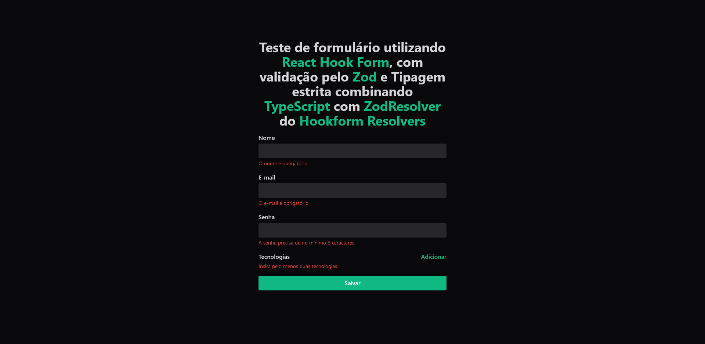

# Formulário com validação no FrontEnd
### Deploy Link: _[Click Here](https://react-hook-form-w-zod-validation.vercel.app/)_
#
## Tecnologias Utilizadas

- **React TS**
- **React Hook Form**
- **Hookform Resolvers**
- **Zod**
- **Tailwind CSS**


#

### Tipos de Validações:

- **Todos os Campos Obrigatórios**

- **Apenas e-mails de provedores listados (hotmail, gmail, etc)**

- **Senha forte: 1 maiúscula, 1 minúscula, 1 número, 1 símbolo, mínimo de 8 caracteres**

- **Testa da Feature FieldArrays do React Hook Form no campo Tecnologias: 'n' número de campos podem ser adicionados (ou nenhum, se for o caso. Aqui foi especificado o mínimo de 2 a serem adicionados)**

- **O nome da tecnologia precisa ser adicionado, bem como o nível de proficiência (de 1 a 100)**
#
### Lógica:
```tsx
// criação do schema para inferir os dados no formulário
const createUserFormSchema = z.object({

  // validação do campo nome
  name: z.string()
    .nonempty('O nome é obrigatório')
    .transform(name => {
      return name.trim().split(' ').map(word => {
        return word[0].toLocaleUpperCase().concat(word.substring(1))
      }).join(' ')
    }),
  // validação do campo e-mail
  email: z.string()
    .nonempty('O e-mail é obrigatório')
    .email('Formato de e-mail inválido')
    .toLowerCase()
    .refine(email => {
      return emailProviders.some(provider => email.endsWith(provider))
    }, 'Provedor de e-mail inválido'),
  // validação do campo senha
  password: z.string()
    .min(8, 'A senha precisa de no mínimo 8 caracteres')
    .refine(password => /[A-Z]/.test(password), 'A senha deve conter pelo menos uma letra maíuscula')
    .refine(password => /[a-z]/.test(password), 'A senha deve conter pelo menos uma letra minúscula')
    .refine(password => /\d/.test(password), 'A senha deve conter pelo menos um número')
    .refine(password => /[!@#$%^&*(),.?":{}|<>]/.test(password), 'A senha deve conter pelo menos um símbolo'),
  // validação do campo tecnologia
  techs: z.array(z.object({
    title: z.string().nonempty('O nome da tecnologia é obrigatório'),
    knowledge: z.coerce.number().min(1).max(100)
  })).min(2, 'Insira pelo menos duas tecnologias'),
})

// array de provedores de e-mail permitidos
const emailProviders = [
  '@hotmail.com',
  '@outlook.com',
  '@yahoo.com',
  '@gmail.com',
  '@live.com',
  '@protonmail.com',
  '@icloud.com',
]
```
### Uso das bibliotecas
```tsx
// tipagem dos dados da função submit
type createUserFormData = z.infer<typeof createUserFormSchema>

// useForm() com tipagem dos dados inferidos pelo zod
const {
    register,
    handleSubmit,
    formState: { errors },
    control,
  } = useForm<createUserFormData>({
    resolver: zodResolver(createUserFormSchema)
  })

// useFieldArray() que lidará com o array de objetos techs
const { fields, append, remove } = useFieldArray({
  name: 'techs',
  control,
})

// criação de um novo objeto no array [techs], adicionando o objeto com os valores title (def: '') e knowledge (def: 1)
function addNewTech() {
  append({ title: '', knowledge: 1 })
}

// função de submit, que exemplifica o output em tela renderizando ao final do form o conteúdo com objeto User
const [output, setOutput] = useState('')

function createUser(data: createUserFormData) {
  setOutput(JSON.stringify(data, null, 2))
}

// output (techs sem ID a fins de exemplificação)
{
  "name": "nomeInserido",
  "email": "email@email.com",
  "password": "p@sSw0rd",
  "techs": [
    {
      "title": "techName1",
      "knowledge": "1",
    },
    {
      "title": "techName2",
      "knowledge": "99",
    }
  ]
}
```